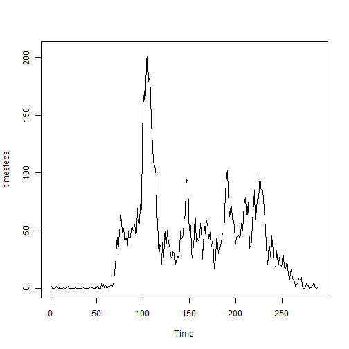
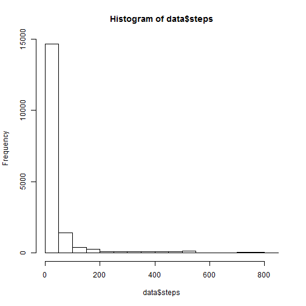
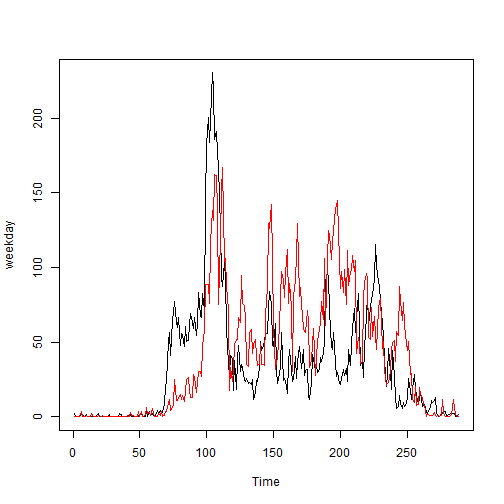

Load data into R


```r
setwd("C:/Classes/RepRes/Project 1")
data<-read.csv("./activity.csv")
library(plyr)
```

What is the mean total number of steps taken per day?


```r
hist(data$steps)
```

 

```r
mean(data$steps, na.rm=T)
```

```
## [1] 37.38
```

```r
median(data$steps, na.rm=T)
```

```
## [1] 0
```

What is the average daily pattern?


```r
data2 <- ddply(data,.(interval),summarise,steps=mean(steps, na.rm=T))
timesteps<-ts(data2$steps)
plot(timesteps)
```

 

Impute missing values using the average step count for each time interval across all days.


```r
sum(is.na(data$steps))
```

```
## [1] 2304
```

```r
data[is.na(data$steps),]$steps<-join(data[is.na(data$steps),],data2,by="interval")[,4]
hist(data$steps)
```

 

```r
mean(data$steps, na.rm=T)
```

```
## [1] 37.38
```

```r
median(data$steps, na.rm=T)
```

```
## [1] 0
```

Here we see an increase in the number of values being reported in the histogram, but we see no change to the mean or the median of the new dataset.

Examine weekends vs weekdays:

```r
data$date<-as.Date(data$date)
data$day <- weekdays(data$date)
data$daytype <- weekdays(data$date)
data[data$day %in% c("Saturday","Sunday"),]$daytype<-"Weekend"
data[!(data$day %in% c("Saturday","Sunday")),]$daytype<-"Weekday"

data3<-ddply(data,.(daytype,interval),summarise,avgsteps=mean(steps))
weekday<-ts(data3[data3$daytype=="Weekday",3])
weekend<-ts(data3[data3$daytype=="Weekend",3])
plot(weekday)
lines(weekend,col="red")
```

 
